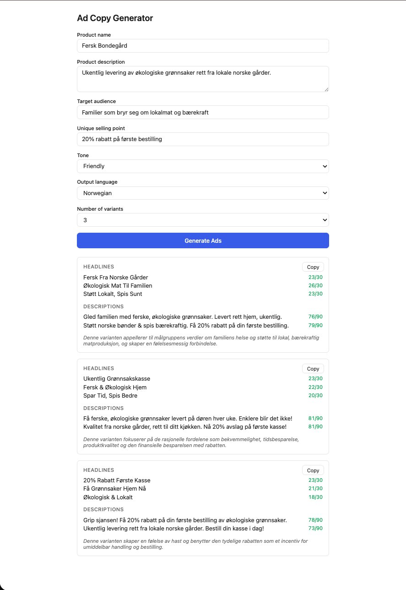

# Ad Copy Generator

A small web app that generates Google Ads copy (headlines and descriptions)
from a short product brief, powered by Google Gemini. Built as a portfolio
project to explore LLM integration, serverless functions, and domain-aware
UX.

## Demo

Live: <https://google-ads-copy-generator.netlify.app>

## What it does

1. User fills a short brief (product name, description, audience, USP, tone,
   language, number of variants).
2. A Netlify Function forwards the brief to Gemini 2.5 Flash with a strict
   prompt and JSON response mode.
3. The app renders the returned variants, each with headlines, descriptions,
   a rationale, live character counters, and a one-click copy-to-clipboard
   button formatted for Google Ads.

Supported output languages: English, Norwegian.
Supported tones: Professional, Friendly, Urgent, Playful.

## Why the 30 / 90 character limits matter

Google Ads uses **Responsive Search Ads** as the dominant format. Each
headline has a hard limit of **30 characters** and each description **90
characters** — including spaces. Copy that exceeds these limits is
rejected by Google at upload time.

LLMs do not count characters reliably (they generate token-by-token without
a built-in counter), so the app enforces this in three layers:

1. The prompt instructs Gemini to respect the limits.
2. `responseMimeType: 'application/json'` forces structured output.
3. Live character counters in the UI show `current/max` in green or red,
   so the user can spot over-limit variants before pasting into Google Ads.

This is the core domain insight of the project: treating the LLM as
unreliable on a specific dimension and designing UX around that.

## Tech stack

| Layer       | Choice                          | Why                                    |
| ----------- | ------------------------------- | -------------------------------------- |
| Frontend    | React 19 + TypeScript + Vite    | Fast dev loop, type safety             |
| Styling     | CSS Modules                     | No framework lock-in, scoped styles    |
| Backend     | Netlify Functions (Node)        | Zero-ops serverless, free tier         |
| LLM         | Google Gemini 2.5 Flash         | Fast, cheap, native JSON mode          |
| Local E2E   | Netlify CLI (`netlify dev`)     | Matches prod runtime on localhost      |

## Local development

```bash
git clone https://github.com/jerzyszajner/ad-copy-generator.git
cd ad-copy-generator
npm install

cp .env.example .env
# edit .env and paste your GEMINI_API_KEY

npm run netlify:dev
# opens http://localhost:8888
```

`netlify dev` is required (not plain `vite`) so the frontend can call the
serverless function at `/.netlify/functions/generate-ads` exactly as it
will in production.

Get a Gemini API key at <https://aistudio.google.com/apikey>.

## Project structure

```
src/
├── components/
│   ├── AdForm/       # brief form, submit, loading + error states
│   ├── AdResults/    # list of variants, empty state
│   └── AdVariant/    # single variant with counters + copy button
├── lib/
│   ├── prompt.ts     # builds the Gemini prompt from user input
│   └── types.ts      # shared AdInput / AdVariant / AdResponse types
└── App.tsx           # wires form ↔ results via local state

netlify/functions/
└── generate-ads.ts   # serverless endpoint: input → Gemini → JSON
```

## Design decisions (and non-goals)

This is an MVP. The main trade-offs:

- **No automated tests.** Scope kept tight for a portfolio project; the
  full flow was verified end-to-end locally via `netlify dev`.
- **No rate limiting.** The Gemini key is protected by running inside
  a serverless function, but a deployed instance could still be abused.
  Fine for a portfolio demo, not for real traffic.

A production version would revisit both.

## Preview

The app generating 3 ad variants in Norwegian for an organic vegetable
delivery service, with all character counts within Google Ads limits:



## License

MIT — see [LICENSE](./LICENSE).
